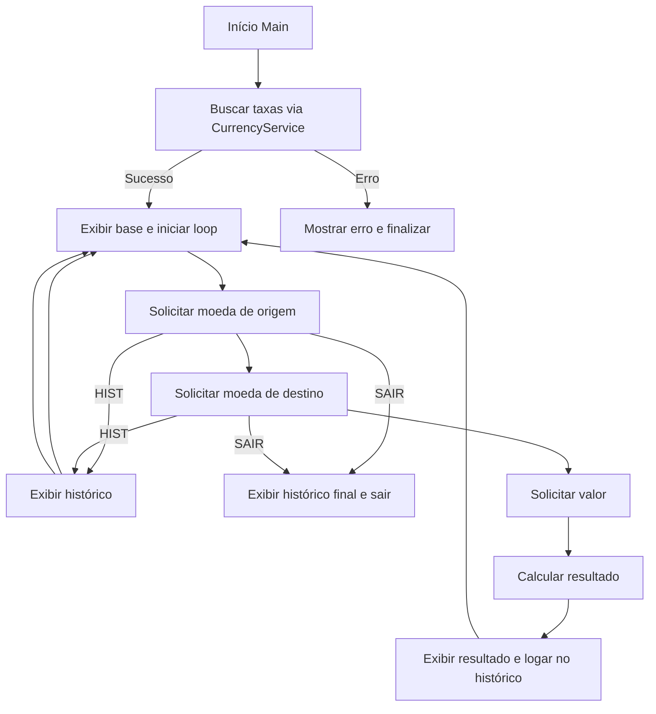
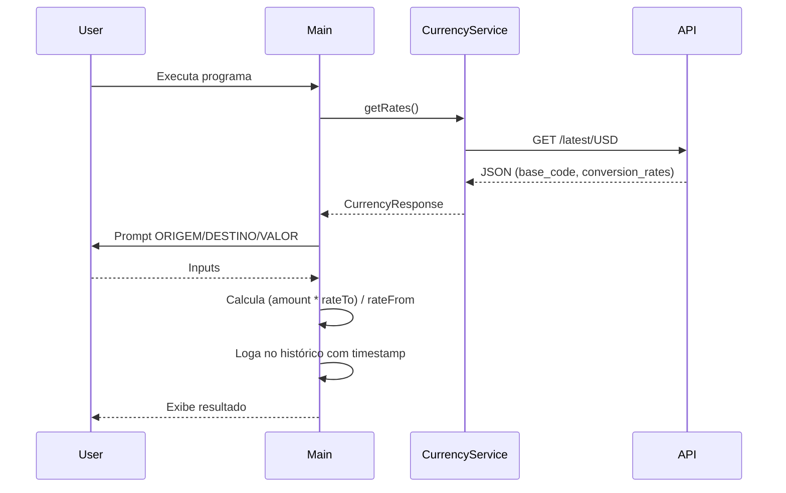
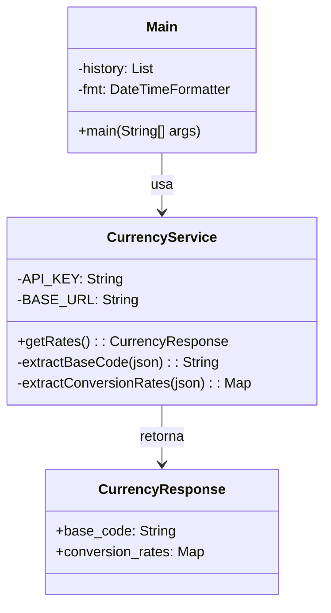
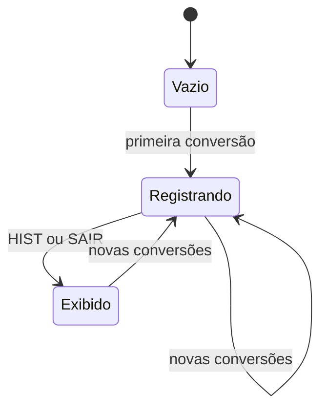

# Conversor de Moedas (Java)

Aplicação de console que consulta taxas da ExchangeRate-API v6, converte valores entre diversas moedas e mantém histórico com timestamps.

## Funcionalidades
- Conversão entre múltiplas moedas suportadas pela API.
- Histórico da sessão com timestamps (java.time).
- Comando HIST para visualizar o histórico a qualquer momento.
- Parsing de JSON sem dependências externas (regex).

## Pré-requisitos
- Java 11+.
- Configurar a API Key em CurrencyService.API_KEY.

## Configuração
1. Abra `src/CurrencyService.java`.
2. Substitua `API_KEY` pela sua chave da ExchangeRate-API.
3. Opcional: altere a `BASE_URL` para outra base (padrão: USD).

## Execução
1. Compile o projeto e execute `Main`.
2. Use `HIST` para ver o histórico e `SAIR` para encerrar.

## Fluxo geral

## Sequência de uma conversão

## Estrutura das classes

## Estados do histórico na sessão

## Notas
- O histórico é apenas em memória (limpa ao encerrar).
- A lista de moedas sugeridas é informativa; qualquer código presente em `conversion_rates` é aceito.
- Em caso de erro HTTP ou resposta inválida, é lançada exceção com mensagem descritiva.
